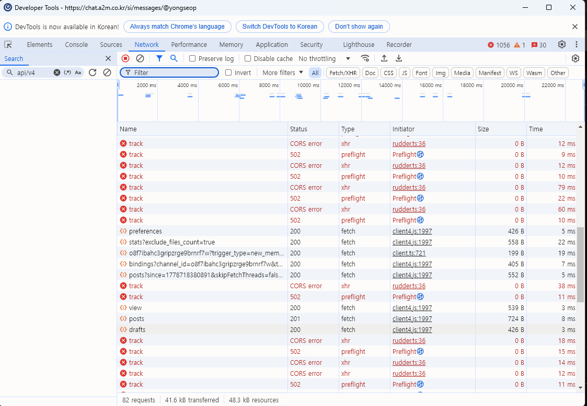

# 📬 사내 메일 메타모스트 알림봇 (Mattermost Mail Bot)

사내 메일(POP3)을 실시간으로 감시하여 새로운 메일이 도착하면 **메타모스트(Mattermost)**로 즉시 푸시 알림을 보내주는 파이썬 기반 자동화 시스템입니다.

---

## 📸 1. 주요 기능 및 실행 화면

새 메일이 오면 보낸 사람, 제목 정보와 함께 **메일함으로 즉시 이동할 수 있는 바로가기 링크**가 제공됩니다.

> **[참고]** 알림 메시지 하단의 '메일함 확인하기'를 누르면 사내 웹메일 시스템으로 연결됩니다.

---

## 🛠 2. 환경 구성 및 사전 준비

### **필수 요구 사항**

- **Language:** Python 3.x
- **Library:** `pip install -r requirements.txt`
- **민감 정보 관리:** `.env` 파일에 계정 정보를 저장하여 보안을 유지합니다.

### **프로젝트 구조**

```text
.
├─ src/
│  └─ mail_bot.pyw       # 백그라운드 실행용 메인 스크립트
├─ scripts/
│  ├─ run_bot.bat        # 백그라운드 실행 배치 파일
│  └─ diagnose_bot.bat   # 설치/환경 진단용 배치 파일
├─ data/
│  ├─ last_idx.txt       # 마지막 읽은 메일 번호 기록
│  └─ logs/              # 실행 및 진단 로그
├─ docs/
│  └─ img/               # README 안내 이미지
│     ├─ m1.png
│     ├─ m2.png
│     ├─ token.png
│     ├─ c1.png
│     ├─ sch1.png
│     ├─ sch2.png
│     ├─ sch3.png
│     ├─ sch4.png
│     └─ admin.png
├─ .env                  # 계정 및 토큰 설정 파일
├─ .env.example.txt      # 환경 변수 예시 파일
├─ requirements.txt      # 파이썬 의존성 목록
└─ README.md             # 사용 및 설정 안내
```

> `scripts/run_bot.bat`과 `src/mail_bot.pyw`는 프로젝트 루트를 기준으로 동작하므로, 폴더를 다른 위치로 옮겨도 절대 경로를 수정할 필요가 없습니다.

---

## ⚠️ 3. 핵심 유지보수: 토큰 및 ID 추출

먼저 **알림을 받을 메타모스트 개인 비공개 채널**을 생성해야 합니다. 채널을 만들지 않았거나 다른 채팅방에서 값을 추출하면 알림이 엉뚱한 곳으로 가거나 전송에 실패할 수 있습니다.

채널 생성 후에는 반드시 그 채널에 들어간 상태에서 아래 작업을 진행해 주세요.

1. 알림 전용 개인 비공개 채널 생성
2. 해당 채널에 테스트 메시지 전송
3. 개발자 도구에서 `MMAUTHTOKEN`과 `channel_id` 추출
4. 추출한 값을 `.env`의 `MMAUTHTOKEN`, `MY_CHANNEL_ID`에 입력

봇이 작동하지 않는다면 대부분 **인증 토큰(MMAUTHTOKEN)**이 만료되었거나 **채널 ID(MY_CHANNEL_ID)**가 잘못된 경우입니다. 메타모스트 윈도우 앱의 개발자 도구를 열어 값을 갱신해 주세요.

### **(1) 알림용 개인 비공개 채널 생성**

메타모스트에서 알림을 받을 전용 채널을 먼저 만듭니다.

- 채널 유형은 **비공개 채널**로 생성합니다.
- 본인만 사용할 알림 전용 채널을 권장합니다.
- 이후 개발자 도구에서 값을 확인할 때는 반드시 이 채널에 들어간 상태에서 테스트 메시지를 보내야 합니다.

### **(2) 메타모스트 개발자 도구 열기**

메타모스트 윈도우 앱 좌측 상단 메뉴에서 **보기 -> Developer Tools -> 애플리케이션용 개발자 도구**를 선택합니다.


개발자 도구가 열리면 **Network** 탭을 연 뒤, 아무 채팅창에 테스트 메시지를 하나 보냅니다. 메시지를 보내면 Network 목록에 `posts` 요청이 생기며, 이 요청을 선택해 토큰과 채널 ID를 확인합니다.



### **(3) MMAUTHTOKEN 확인**


- 개발자 도구 `Network` 탭 -> `Cookies` -> `MMAUTHTOKEN` 값을 복사하여 `.env`에 붙여넣습니다.

### **(4) CHANNEL_ID 및 메시지 정보 확인**


- 알림을 보낼 채널의 고유 ID는 `Request Payload`의 `channel_id` 항목에서 확인할 수 있습니다.

---

## 🖥 4. 윈도우 작업 스케줄러 자동 실행 설정

PC를 켜면 자동으로 봇이 실행되도록 설정하는 단계입니다. 사진을 보고 그대로 따라 하세요.

### **Step 1: 기본 작업 생성**


1. **[작업 만들기]** 클릭 후 이름 입력.
2. **[가장 높은 수준의 권한으로 실행]**에 반드시 체크합니다.

### **Step 2: 실행 트리거 설정**


1. **[트리거]** 탭 -> [새로 만들기].
2. 작업 시작 기준을 **[로그온할 때]**로 설정합니다.

### **Step 3: 실행 동작(파일 경로) 지정**


1. **[동작]** 탭 -> [새로 만들기].
2. 프로그램/스크립트: 프로젝트 폴더의 `scripts\run_bot.bat` 지정.
3. **시작 위치(옵션):** 프로젝트 폴더 경로 입력.

### **Step 4: 작업 등록 완료**


1. 등록된 작업을 우클릭하여 **[실행]**을 누르면 봇이 즉시 가동됩니다.

---

## 🔍 5. 정상 작동 확인 (상태 체크)

설치나 설정이 제대로 되었는지 먼저 확인하려면 `scripts\diagnose_bot.bat`를 실행합니다.

- 진단이 성공하면 `Diagnosis passed`가 표시됩니다.
- 문제가 있으면 Python 설치, `.env`, 패키지, 문법, 메일 서버 접속 중 어디서 실패했는지 표시됩니다.
- 진단 성공 시 `data\last_idx.txt`가 현재 메일 개수 기준으로 초기화됩니다.
- 상세 로그는 `data\logs\run_bot.log`에서 확인할 수 있습니다.

봇이 백그라운드에서 잘 돌고 있는지 궁금하다면 작업 관리자를 확인하세요.


- **작업 관리자(`Ctrl+Shift+Esc`)** -> [세부 정보] 탭에서 `pythonw.exe` 또는 **Python** 프로세스가 실행 중인지 확인합니다.

---

## 💡 유의 사항 및 팁

- **보안망 우회:** 사내망 환경을 고려하여 SSL 검증 무시(`verify=False`) 로직이 포함되어 있습니다.
- **메일 POP3 설정:** 메일 계정에서 POP3 사용이 허용되어 있는지 확인해 주세요. 로그에 `You are Not allowed`가 표시되면 계정/비밀번호 오류뿐 아니라 POP3 접근 권한이 막혀 있을 수 있습니다.
- **아침 보고:** 매일 오전 08:00에 봇의 정상 작동 여부를 알림으로 알려줍니다.
- **프로필 사진:** 메타모스트 아바타는 본인 프로필 설정을 따라갑니다.

---

**Last Updated:** 2026-05-18  
**Maintainer:** 원영
