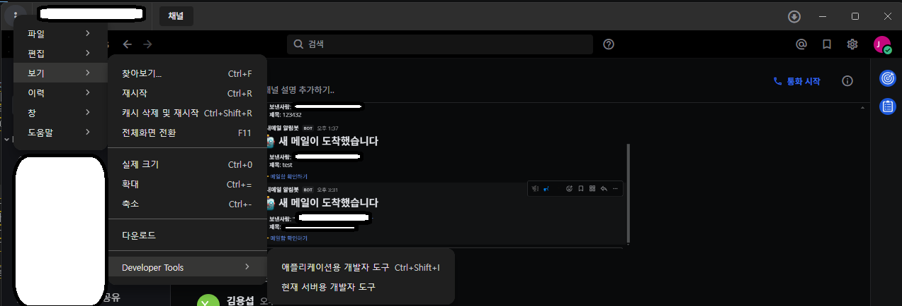
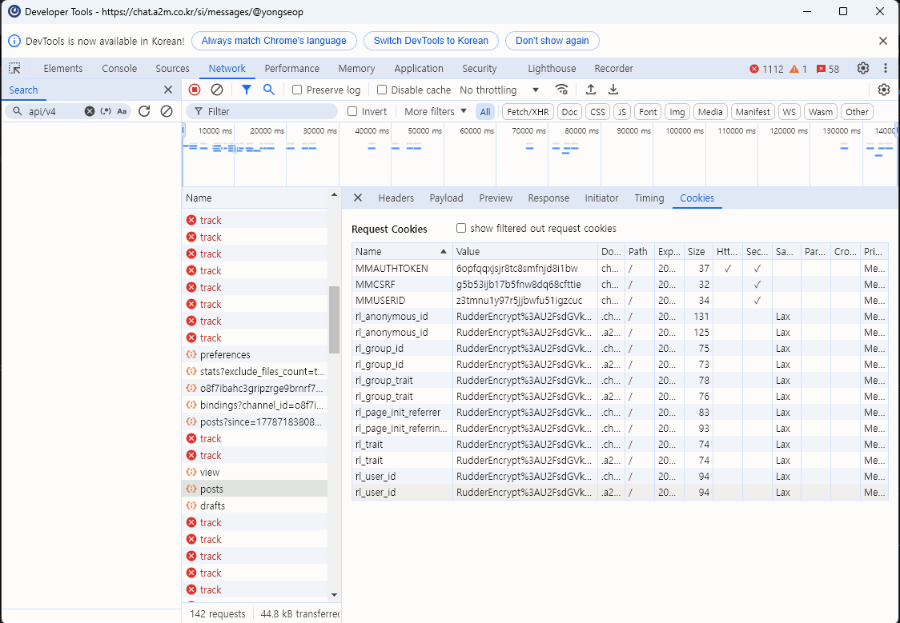
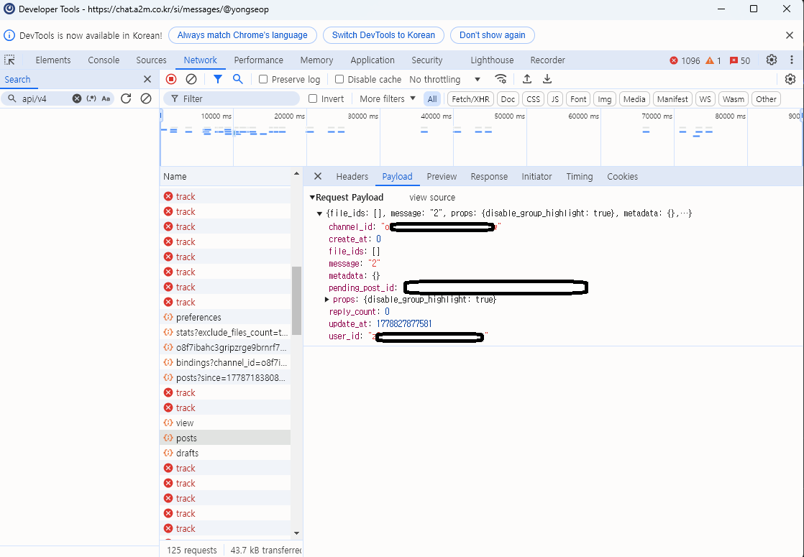
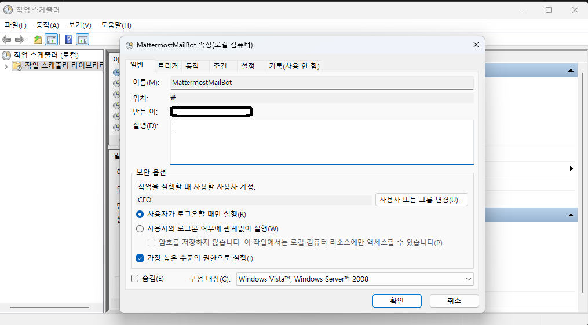
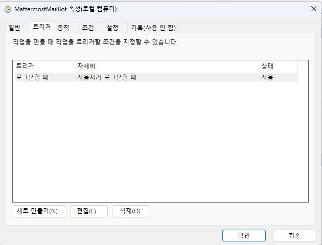
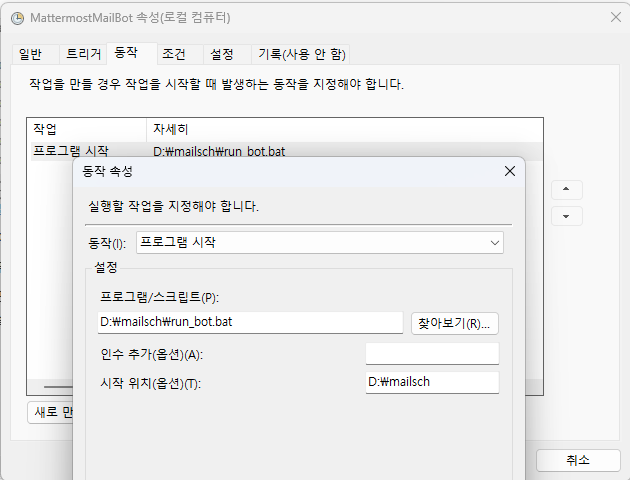
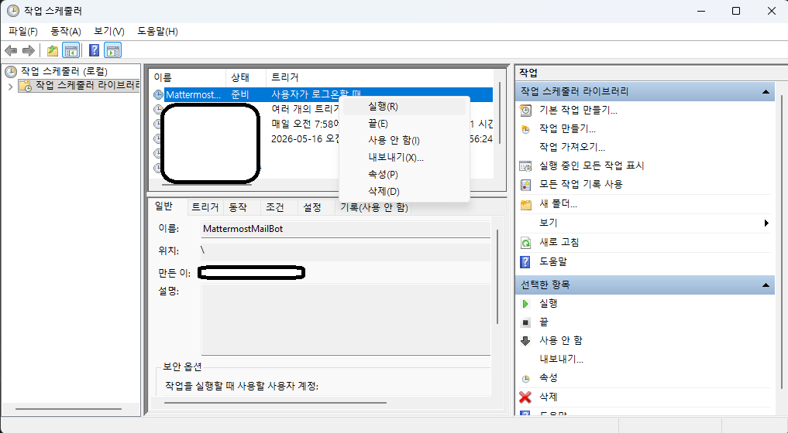
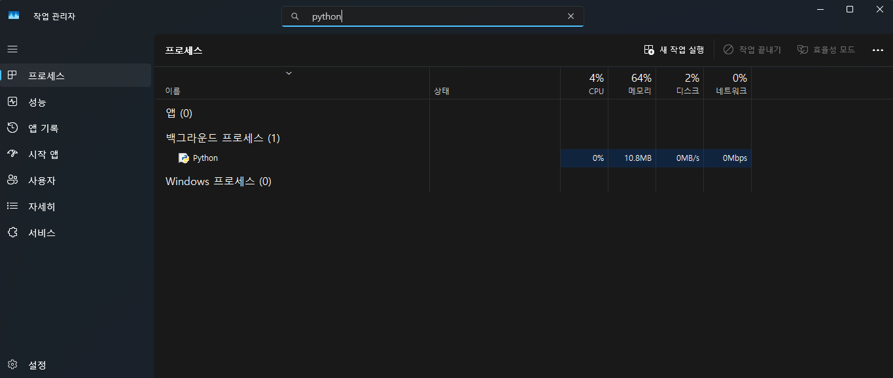

# 📬 사내 메일 메타모스트 알림봇 (Mattermost Mail Bot)

사내 메일(POP3)을 실시간으로 감시하여 새로운 메일이 도착하면 **메타모스트(Mattermost)**로 즉시 푸시 알림을 보내주는 파이썬 기반 자동화 시스템입니다.

---

## 📸 1. 주요 기능 및 실행 화면

새 메일이 오면 보낸 사람, 제목 정보와 함께 **메일함으로 즉시 이동할 수 있는 바로가기 링크**가 제공됩니다.



> **[참고]** 알림 메시지 하단의 '메일함 확인하기'를 누르면 사내 웹메일 시스템으로 연결됩니다.

---

## 🛠 2. 환경 구성 및 사전 준비

### **필수 요구 사항**

- **Language:** Python 3.x
- **Library:** `pip install -r requirements.txt`
- **민감 정보 관리:** `.env` 파일에 계정 정보를 저장하여 보안을 유지합니다.

### **프로젝트 구조**

```text
.
├─ src/
│  └─ mail_bot.pyw       # 백그라운드 실행용 메인 스크립트
├─ scripts/
│  └─ run_bot.bat        # 윈도우 실행 배치 파일
├─ data/
│  └─ last_idx.txt       # 마지막 읽은 메일 번호 기록
├─ docs/
│  └─ img/               # README 안내 이미지
│     ├─ m1.png
│     ├─ token.png
│     ├─ c1.png
│     ├─ sch1.png
│     ├─ sch2.png
│     ├─ sch3.png
│     ├─ sch4.png
│     └─ admin.png
├─ .env                  # 계정 및 토큰 설정 파일
├─ .env.example.txt      # 환경 변수 예시 파일
├─ requirements.txt      # 파이썬 의존성 목록
└─ README.md             # 사용 및 설정 안내
```

> `scripts/run_bot.bat`과 `src/mail_bot.pyw`는 프로젝트 루트를 기준으로 동작하므로, 폴더를 다른 위치로 옮겨도 절대 경로를 수정할 필요가 없습니다.

---

## ⚠️ 3. 핵심 유지보수: 토큰 및 ID 추출

봇이 작동하지 않는다면 대부분 **인증 토큰(MMAUTHTOKEN)**이 만료된 경우입니다. 브라우저 개발자 도구(`F12`)를 통해 값을 갱신해 주세요.

### **(1) MMAUTHTOKEN 확인**



- 브라우저 `Network` 탭 -> `Cookies` -> `MMAUTHTOKEN` 값을 복사하여 `.env`에 붙여넣습니다.

### **(2) CHANNEL_ID 및 메시지 정보 확인**



- 알림을 보낼 채널의 고유 ID는 `Request Payload`의 `channel_id` 항목에서 확인할 수 있습니다.

---

## 🖥 4. 윈도우 작업 스케줄러 자동 실행 설정

PC를 켜면 자동으로 봇이 실행되도록 설정하는 단계입니다. 사진을 보고 그대로 따라 하세요.

### **Step 1: 기본 작업 생성**



1. **[작업 만들기]** 클릭 후 이름 입력.
2. **[가장 높은 수준의 권한으로 실행]**에 반드시 체크합니다.

### **Step 2: 실행 트리거 설정**



1. **[트리거]** 탭 -> [새로 만들기].
2. 작업 시작 기준을 **[로그온할 때]**로 설정합니다.

### **Step 3: 실행 동작(파일 경로) 지정**



1. **[동작]** 탭 -> [새로 만들기].
2. 프로그램/스크립트: 프로젝트 폴더의 `scripts\run_bot.bat` 지정.
3. **시작 위치(옵션):** 프로젝트 폴더 경로 입력.

### **Step 4: 작업 등록 완료**



1. 등록된 작업을 우클릭하여 **[실행]**을 누르면 봇이 즉시 가동됩니다.

---

## 🔍 5. 정상 작동 확인 (상태 체크)

봇이 백그라운드에서 잘 돌고 있는지 궁금하다면 작업 관리자를 확인하세요.



- **작업 관리자(`Ctrl+Shift+Esc`)** -> [세부 정보] 탭에서 `pythonw.exe` 또는 **Python** 프로세스가 실행 중인지 확인합니다.

---

## 💡 유의 사항 및 팁

- **보안망 우회:** 사내망 환경을 고려하여 SSL 검증 무시(`verify=False`) 로직이 포함되어 있습니다.
- **아침 보고:** 매일 오전 08:00에 봇의 정상 작동 여부를 알림으로 알려줍니다.
- **프로필 사진:** 메타모스트 아바타는 본인 프로필 설정을 따라갑니다.

---

**Last Updated:** 2026-05-15  
**Maintainer:** 원영
